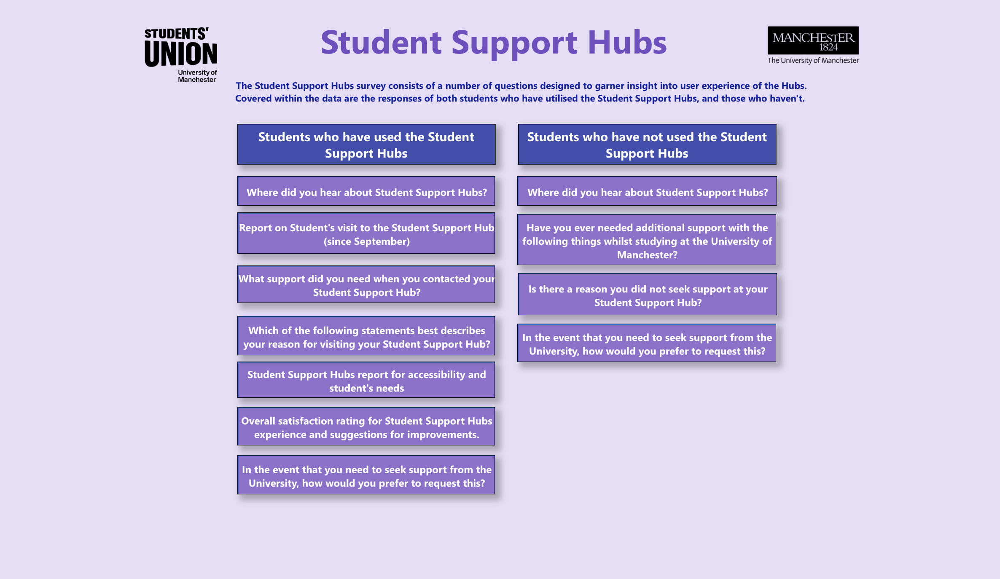
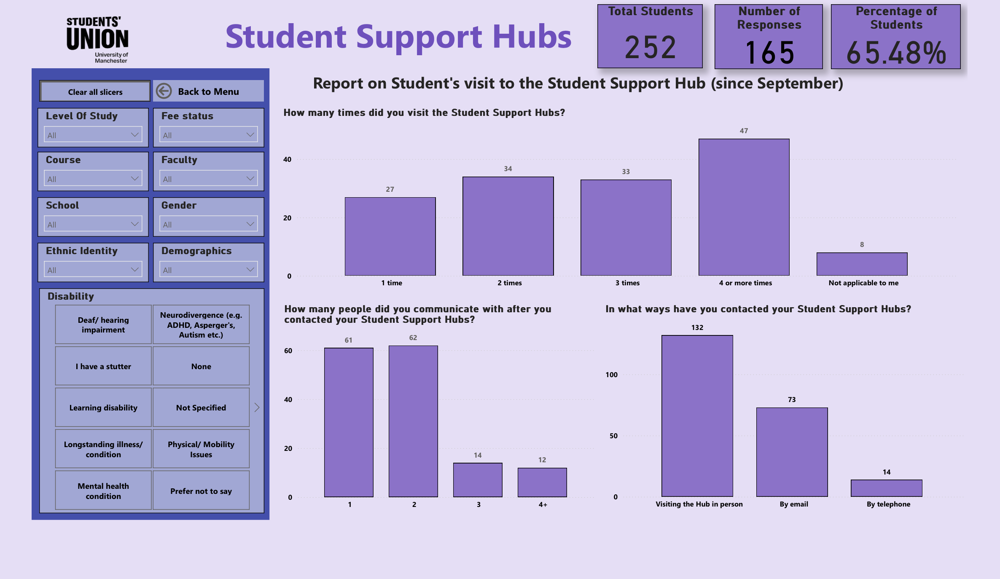

# Student Support Hubs Dashboard

## 1. Introduction
This repository hosts the Power BI dashboard for the Student Support Hubs at the University of Manchester. The dashboard provides insights into student experiences, usage patterns, and satisfaction levels with the Support Hubs. It aims to enhance support services and ensure they meet student needs effectively.

## 2. Understanding HR requirements
The Student Support Hubs survey consists of a number of questions designed to garner insight into the user experience of the Hubs. The data covers responses from students who have utilized the Student Support Hubs and those who haven't.

## 3. The dashboard
### Overview
The dashboard is divided into sections for students who have used the Student Support Hubs and those who have not. It includes detailed views on various aspects such as how students heard about the Hubs, their reasons for visiting or not visiting, the support they sought, and their overall satisfaction.

### Key Performance Indicators (KPIs)
At the top of each section, the following KPIs are displayed:
- **Total Students**: The total number of students surveyed.
- **Number of Responses**: The number of responses received from the surveyed students.
- **Percentage of Students**: The percentage of students who responded to the survey.

### Filters
The dashboard includes several filters to help drill down into specific data points:
- **Level of Study**
- **Fee Status**
- **Course**
- **Faculty**
- **School**
- **Gender**
- **Ethnic Identity**
- **Demographics**
- **Disability Status**

### Sections
#### Students who have used the Student Support Hubs
This section covers:
- Where students heard about the Support Hubs.
- Reports on student visits to the Hubs since September.
- The type of support needed when contacting the Hubs.
- Statements describing the reason for visiting the Hubs.
- Accessibility and needs reports for the Support Hubs.
- Overall satisfaction ratings and suggestions for improvements.

#### Students who have not used the Student Support Hubs
This section covers:
- Where students heard about the Support Hubs.
- Whether additional support was needed while studying.
- Reasons for not seeking support at the Hubs.
- Preferred methods for requesting support if needed.

## 4. Conclusion
The Student Support Hubs dashboard is a valuable tool for understanding student needs and enhancing support services. By analyzing survey data, the University of Manchester can make informed decisions to improve the accessibility and effectiveness of the Student Support Hubs.
